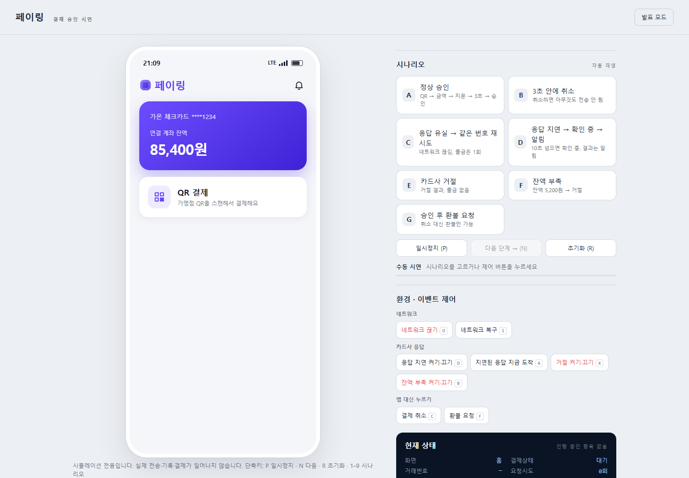
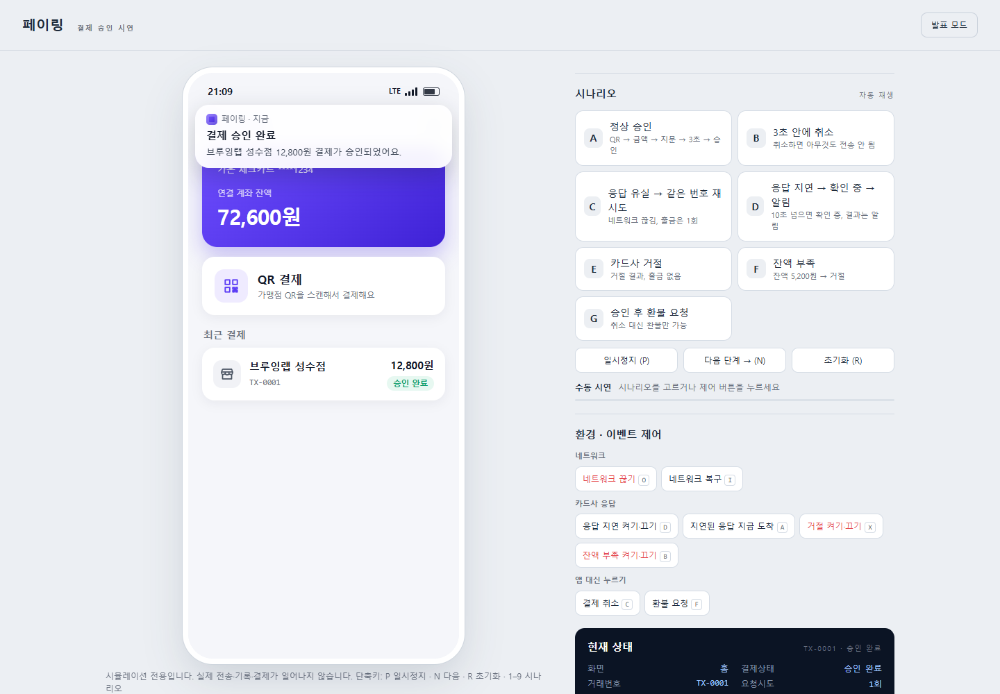
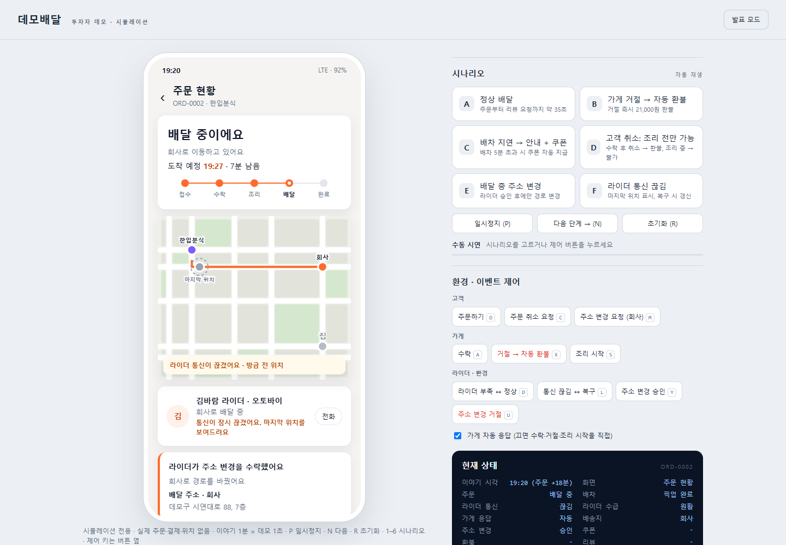
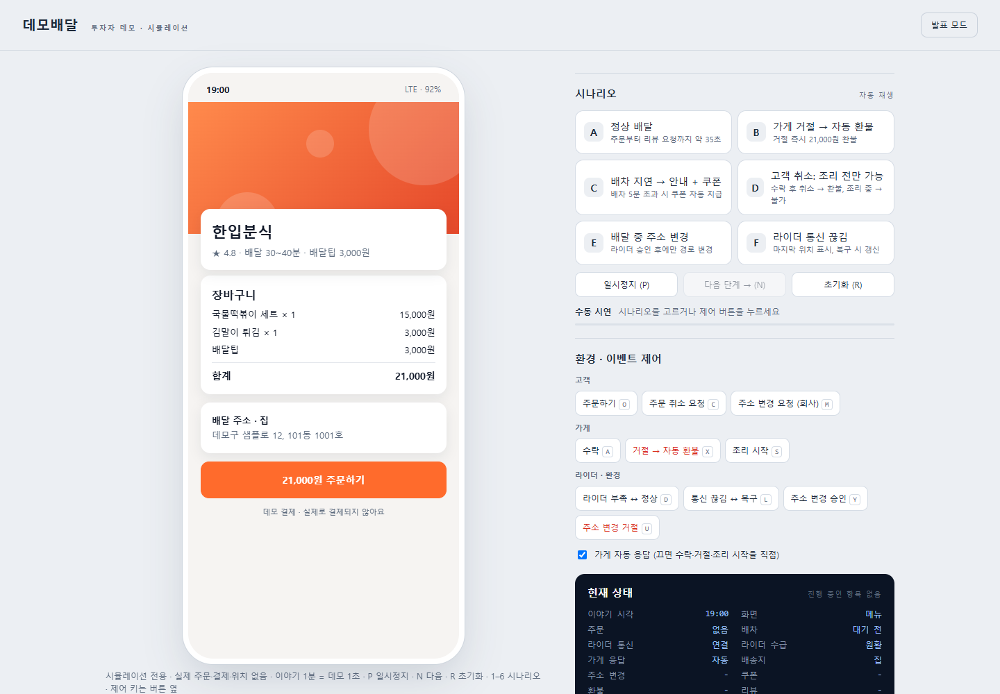

# phro-interactive-demo

앱 기획서(기능·플로우·상태 규칙)만 주면 **발표용으로 바로 쓸 수 있는 동작하는 데모**를 만들어 주는 Claude Code 플러그인입니다.

화면 몇 장을 이어 붙인 목업이 아니라 **상태 시뮬레이터**를 만듭니다. 화면은 상태를 그릴 뿐이고, 전이·타이밍·예외·불변식은 실제 제품과 똑같이 동작합니다. 네트워크·서버·결제·상대방 같은 외부 요소는 전부 가짜로 처리합니다.



## 무엇이 만들어지나

| 구성 | 내용 |
|---|---|
| **기기 화면** | 모바일·태블릿·웹·키오스크 등 실제 앱처럼 보이고 조작되는 화면 |
| **발표자 콘솔** | 시나리오 자동 재생, 일시정지 / 다음 단계 / 초기화, 환경·상대방 제어(네트워크 끊기, 서버 지연, 거절 등), 실시간 상태, 이벤트 타임라인 |
| **발표 모드** | 콘솔을 숨기고 기기만 가운데에. 예외 상황은 단축키로 계속 발생시킬 수 있음 |

데모가 지키는 원칙:

- **데모가 시간을 소유** — 일시정지하면 모든 타이머가 멈추고, 다음 단계는 남은 시간을 건너뛰며, 같은 입력은 항상 같은 결과를 냅니다.
- **엔티티 정체성 유지** — 진행 중인 주문·거래는 네트워크가 끊겨도 같은 번호를 유지하고, 연타해도 두 번 생기지 않습니다.
- **정책 시간과 연출 시간 분리** — 길게 누르기, 취소 가능 시간 같은 정책 시간은 실제 길이 그대로, 서버 응답·배달 이동 같은 연출 시간만 압축합니다.
- **빌드 없음 · 오프라인** — `index.html`을 더블클릭하면 열리고, 외부 요청이 0건이며, 375px 폭에서도 깨지지 않습니다.

## 설치

```bash
claude plugin marketplace add ThatsHoon/phro-interactive-demo
claude plugin install phro-interactive-demo@phro-interactive-demo
```

## 사용법

Claude Code에서 평소처럼 요청하면 스킬이 자동으로 호출됩니다. 직접 부르려면 `/interactive-demo`.

```
간편결제 앱 결제 승인 플로우 시연 데모 만들어줘. 카드사 미팅용, 모바일.
플로우: QR 스캔 → 금액 확인 → 지문 1초 길게 누르기 → 3초 취소 가능 → 승인 요청 → 결과.
규칙: 네트워크 끊기면 같은 거래번호로 재시도, 절대 이중 결제 금지. 10초 넘으면 '확인 중'.
발표자가 네트워크 끊기, 응답 지연, 거절, 잔액 부족을 직접 누를 수 있어야 해.
```

"앱 데모", "시연용 프로토타입", "UX 시뮬레이터", "시안을 동작하게", "클릭 가능한 목업", "발표용 데모" 같은 표현에 반응합니다. 실제 백엔드가 있는 제품 개발이나 정적 목업 이미지 한 장은 대상이 아닙니다.

### 작업 순서 (게이트 3개)

1. **인테이크** — 기획서에 빠진 것을 번호 목록 한 번에, 기본값과 함께 묻고 멈춥니다. "알아서 해"라고 하면 기본값으로 진행합니다.
2. **규칙 명세 `RULES.md`** — 엔티티, 상태, 전이, 불변식, 예외, 타이밍(정책/연출), 시나리오. 🚧 승인 전에는 코드를 쓰지 않습니다.
3. **디자인 에셋** — Figma MCP → 내보낸 이미지 → 스크린샷 → 없으면 브랜드 색 기반 UI.
4. **상태 엔진 + 테스트** — 전이·예외·불변식·시나리오마다 테스트. 🚧 전부 통과해야 화면 작업으로 넘어갑니다.
5. **화면** — 상태의 순수 함수. 카운트다운 같은 프레임 단위 값은 깜빡임 없이 갱신됩니다.
6. **발표자 콘솔** — 명세의 모든 예외에 버튼과 단축키를 붙입니다.
7. **브라우저 검증** — Playwright로 실제 클릭·길게 누르기, 모든 시나리오 끝까지, `file://` 로딩, 375px, 콘솔 에러·외부 요청 0건을 확인하고 스크린샷을 남깁니다. 🚧
8. **전달** — 발표 방법·규칙·가짜 처리 목록이 담긴 README와 zip.

### 결과물 구조

```
demo/
├─ index.html          발표용 셸 (기기 프레임 + 콘솔)
├─ sim.js              가상 시계, 스케줄러, 시나리오 재생 (도메인 무관)
├─ domain.js           앱 규칙 — 상태·전이·타이밍·시나리오
├─ ui.js               렌더 루프, 이스케이프, 홀드 입력, 단축키
├─ views.js            화면 + 콘솔 구성
├─ styles.css          디자인 토큰 + 화면 스타일
├─ test.cjs            규칙 테스트 (Node 내장 모듈만)
├─ browser.test.cjs    브라우저 검증 + 스크린샷
├─ RULES.md            규칙 명세
└─ README.md           발표 가이드
```

## 적용 사례

아래 두 데모는 벤치마크 3차에서 각각 한 문단짜리 요청만으로 만들어진 결과물입니다. 시안은 없었습니다.

### 1. 간편결제 승인 플로우 (카드사 미팅용)



- 시나리오 7개: 정상 승인, 3초 안에 취소, 응답 유실 후 같은 번호로 재시도, 응답 지연 → 확인 중 → 알림, 거절, 잔액 부족, 승인 후 환불
- 카드사 승인 직후 네트워크가 끊기는 상황에서도 `TX-0001`로 재요청 → 요청 2회, 서버 수신 2회, **출금 1회**가 콘솔에 표시됩니다
- 규칙 테스트 32개, 브라우저 검증 통과

### 2. 배달 주문 추적 (투자자 데모데이용)



- 실제 30~40분 흐름을 이야기 시간 1분 = 데모 1초로 압축해 자동 재생 약 35초
- 가게 거절 → 자동 환불, 배차 5분 초과 → 지연 안내 + 쿠폰, 조리 전까지만 취소, 주소 변경은 라이더 승인 필요, 통신 끊기면 마지막 위치 표시
- 규칙 테스트 50개(4분 59초 / 5분 00초 경계 포함), 브라우저 검증 통과



## 벤치마크

skill-creator 방식으로 같은 요청을 **스킬 사용 / 미사용**으로 각각 실행하고, 결과물을 코드·테스트·Playwright 프로브로 채점했습니다.

| 평가 요청 | 스킬 사용 | 스킬 미사용 |
|---|---|---|
| 결제 승인 (상세 요청, 타이밍·예외 많음) | **15 / 15** | 8 / 15 |
| 배달 추적 (긴 다단계 흐름, 시간 압축) | **15 / 15** | 12 / 15 |
| 헬스장 앱 (한 줄짜리 빈약한 요청) | **5 / 5** | 0 / 5 |
| **통과율** | **100%** | **44%** |

스킬 없이 만들었을 때 주로 실패한 항목:

- 정책 시간과 연출 시간을 나눈 규칙 명세가 없음
- 브라우저 없이 도는 규칙 테스트가 없음
- 일시정지 / 다음 단계 / 초기화 콘솔이 없음
- 발표 모드에서 예외 상황을 일으킬 방법이 없음
- 콘솔이 영어로 남음
- 빈약한 요청에도 질문 없이 추측으로 바로 만들어 버림 (스킬은 기본값을 붙인 질문 12개를 한 번에 묻고 멈춤)

| 반복 | 스킬 사용 | 스킬 미사용 | 바뀐 점 |
|---|---|---|---|
| 1차 | 100% | 49% | 평가 항목 11/11/5개 |
| 2차 | 95% | 44% | 평가 항목 15/15/5개로 강화. 콘솔 한국어 누락 발견 |
| 3차 | **100%** | 44% | 셸 라벨·상태값 현지화 수정 후 재검증 |

**스킬 호출 정확도**: 호출되어야 할 요청 10개와 비슷하지만 호출되면 안 되는 요청 10개, 각 3회 실행. 학습 36/36, 검증 24/24 (precision 100%, recall 100%).

**비용**: 상세 요청 하나당 약 14~16분, 20만 토큰 안팎. 테스트와 브라우저 검증을 직접 돌리기 때문에 스킬 미사용보다 토큰이 평균 4만 개쯤 더 듭니다.

## 플러그인 구성

```
.claude-plugin/        plugin.json, marketplace.json
skills/interactive-demo/
├─ SKILL.md            8단계 워크플로와 계약
├─ references/         intake.md(질문지) · rules-spec.md(명세 형식) · pitfalls.md(자주 하는 실수 17개)
└─ starter/            바로 실행되는 도메인 무관 스타터 (node test.cjs · node browser.test.cjs 통과)
```

스타터의 브라우저 검증은 Playwright가 필요합니다(`npm i -D playwright`). 없으면 설치된 Edge나 Chrome을 사용합니다.
